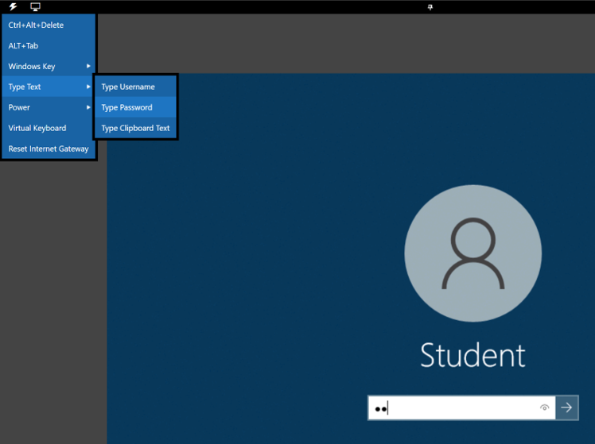
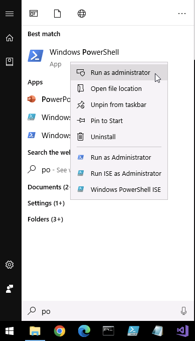
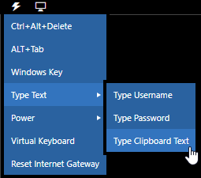
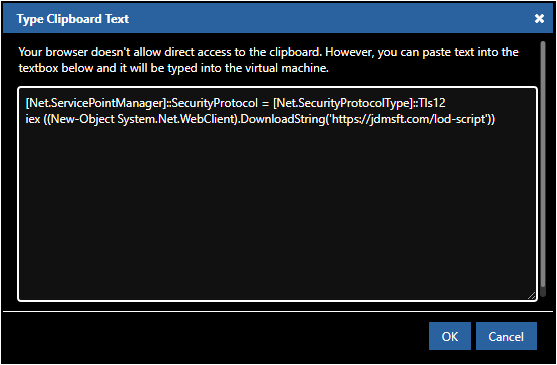
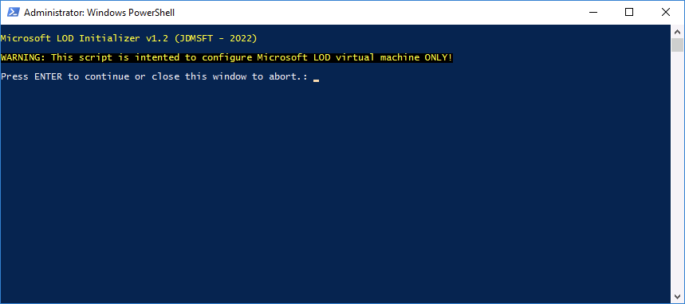
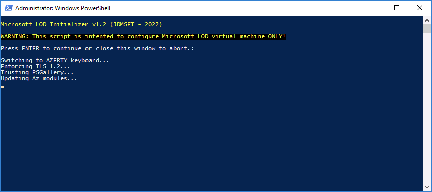

# Microsoft LOD

Microsoft Lab On Demand (LOD) cheatsheet.

## 1. Access to LOD

Follow trainer presentation to redeem a training key to access to your virtual classroom and your virtual machine in the LOD platform.

> Normally you've already done this part! Let's jump to the [second part](#2-update-lab-environment) 😉

## 2. Update lab environment

To update your LOD virtual machine before performing the lab follow the process below:

1. Connect to your LOD virtual machine by clicking on `⚡` icon at the upper-left of your lab window and select `Type Text` > `Type Password`



Then validate your password to log in.

2. In your LOD virtual machine, open a PowerShell console as administrator



3. Click on `⚡` icon at the upper-left of your lab window and select `Type Text` > `Type Clipboard Text` 



4. Paste the code below in the `Type Clipboard Text` window and click `OK`

Code to paste:

````powershell
[Net.ServicePointManager]::SecurityProtocol = [Net.SecurityProtocolType]::Tls12
iex ((New-Object System.Net.WebClient).DownloadString('https://jdmsft.com/lod-script'))
````

In this window:



Don't forget to click on `OK` button!

5. Press `ENTER` key in your VM PowerShell console to run the code.



6. Press `ENTER` again to finalize the lab update.



> This process can take up to 5 minutes. You can jump to the part 3 during this time. 

The update is done when the PowerShell console will automatically close by itself at the end of the process.

## 3. Claim Azure Pass

Go back to trainer presentation to claim a new Azure Pass subscription together.

## 4. Connect to Azure

Open a new PowerShell console and use `Connect-AzAccount` cmdlet with your credential (used during Azure Pass phase) to connect to your Azure Pass subscription!

Enjoy your lab! 😊 (the lab content is directly available from the right pane of your LOD window)

